# 🚀 **API REST com Node.js e Express**

## 📌 Introdução

Este trabalho consiste no desenvolvimento de uma API REST utilizando Node.js e Express, com o objetivo de aplicar conceitos fundamentais de criação de endpoints, manipulação de dados e validações.

A API permite realizar operações de consulta (GET) e cadastro de dados (POST), simulando um sistema real de gerenciamento de recursos.

---

## 🛠️ Tecnologias utilizadas

* Node.js
* Express
* Postman

---

## ⚙️ Configuração do ambiente

```bash
# Criar pasta do projeto
mkdir nome-do-projeto
cd nome-do-projeto

# Inicializar projeto Node.js
npm init -y

# Instalar Express
npm install express

# Instalar Nodemon (opcional)
npm install --save-dev nodemon

# Criar arquivo principal
touch index.js 
# (No PowerShell, utilize: ni index.js)

# Criar arquivo .gitignore (aconselhável)
touch .gitignore
```

---

### 📄 .gitignore (Não enviar arquivos extensos ao GitHub)

Adicionar o seguinte conteúdo:

```bash
node_modules/
.env
package-lock.json
```

---

### 💡 Ajuste do package.json (scripts)

Para facilitar a execução do projeto, é possível configurar scripts no arquivo `package.json`:

```json
"scripts": {
  "start": "node index.js",
  "dev": "nodemon index.js"
}
```

Após isso, você pode iniciar o projeto com:

```bash
npm start
```

ou em modo desenvolvimento:

```bash
npm run dev
```

---

## 🚀 Funcionalidades

* Listagem de dados (GET)
* Busca com filtros
* Cadastro de novos registros (POST)
* Validação de dados de entrada
* Organização dos dados em formato JSON

---

## 📡 Endpoints da API

Na API deste trabalho, foram desenvolvidos os seguintes ENDPOINTS:

* 5 ENDPOINTS **GET**
* 1 ENDPOINTS **POST**

### - GET

```bash
#Tela inicial ao iniciar a API
app.get('/'...)

URL: http://localhost:3000/
```

```bash
app.get('/api/info'...)

URL: http://localhost:3000/api/info
```

```bash
#Listagem de todos os filmes ou filtrados a depender da URI
app.get('/api/filmes'...)

URL: http://localhost:3000/api/filmes
```

```bash
#Lista um filme pelo ID de forma especifíca (PATH PARAMETER)
app.get('/api/filmes/id/:id'...)

URL: http://localhost:3000/api/filmes/id/1
```

```bash
#Lista um filme pelo TÍTULO de forma especifíca (PATH PARAMETER)
app.get('/api/filmes/titulo/:titulo'...)

URL: http://localhost:3000/api/filmes/titulo/o poderoso chefão
```

### - POST
```bash
#Cria um novo registro de filme após realizar as validações
app.post('/api/filmes'...)

URL: http://localhost:3000/api/filmes
```

---

## GET - Listagem dos recursos

📌 **Filtros disponíveis**

* genero → filtra por gênero
* busca → busca por título
* nota_min → nota mínima
* nota_max → nota máxima
* ano_min → ano mínimo
* ano_max → ano máximo

📊 **Ordenação**

* ordem = nota | ano | titulo (3 tipos de ordenação presentes)
* direcao = asc | desc (Ordem **crescente** / **decrescente**)
---

## POST - Criação de recursos

Para adicionar novos recursos com o POST, é necessário inserir um registro em JSON no Postman.

Exemplo (JSON): 

```json
{
  "titulo": "Clube da Luta",
  "diretor": "David Fincher",
  "ano": 1999,
  "genero": "Drama",
  "nota": 8.8
}
```

---

## ✅ **Validações implementadas**

No POST, algumas validações foram implementadas para impedir que um novo registro não fosse inserido de forma incorreta.

Um exemplo é o cadastro do ID que ocorre de forma automática, impedindo assim que o usuário consiga manipular esse valor.

As validações são:

## **1 - Campos obrigatórios**

Todos os campos abaixo são obrigatórios:
* titulo
* diretor
* ano
* genero
* nota

Caso algum campo esteja ausente, o terminal vai apontar um erro:

```JSON
{
  "erro": "Campos obrigatórios: titulo, diretor, ano, genero, nota"
}
```

## **2 - Validação de tipos de dados**

Os tipos devem ser respeitados:

* titulo → string
* diretor → string
* genero → string
* ano → number
* nota → number

Se houver erro de tipo, o terminal irá apontar:
```JSON
{
  "erro": "Titulo, diretor e genero devem ser texto (String)"
}
```
ou
```JSON
{
  "erro": "Ano e nota devem ser números (Number)"
}
```

## **3 - Regras de negócio**

Regras que permitem maior consistência ao sistema, Exemplos:

* O ano não pode ser menor que 1888 (ano do primeiro filme da história).

* A nota deve estar entre 0 e 10

```JSON
{
  "erro": "Ano inválido"
}
```

```JSON
{
  "erro": "Nota deve estar entre 0 e 10"
}
```

## **4 - Validação de tamanho mínimo**

* titulo → mínimo 2 caracteres
* diretor → mínimo 3 caracteres

Exemplos de erro:
```JSON
{
  "erro": "Titulo deve ter pelo menos 2 caracteres"
}
```

```JSON
{
  "erro": "Diretor deve ter pelo menos 3 caracteres"
}
```

---

## 📦 Dados criados via POST
Arquivos JSON utilizados para adicionar recursos ao array:

```JSON
  {
    "titulo": "Clube da Luta",
    "diretor": "David Fincher",
    "ano": 1999,
    "genero": "Drama",
    "nota": 8.8
  },
  {
    "titulo": "De Volta para o Futuro",
    "diretor": "Robert Zemeckis",
    "ano": 1985,
    "genero": "Ficção Científica",
    "nota": 8.5
  },
  {
    "titulo": "A Vida é Bela",
    "diretor": "Roberto Benigni",
    "ano": 1997,
    "genero": "Drama",
    "nota": 8.6
  },
  {
    "titulo": "O Exterminador do Futuro 2",
    "diretor": "James Cameron",
    "ano": 1991,
    "genero": "Ficção Científica",
    "nota": 8.6
  },
  {
    "titulo": "Gladiador",
    "diretor": "Ridley Scott",
    "ano": 2000,
    "genero": "Ação",
    "nota": 8.5
  }
```
---

## 📸 Testes no Postman (Capturas de tela)

### - GETS

- localhost:3000/api/filmes

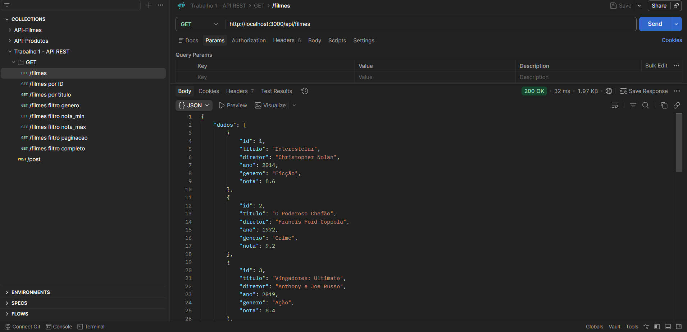

- localhost:3000/api/filmes/id/1

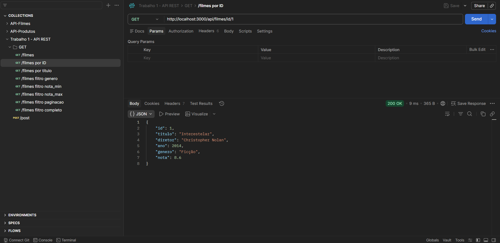

localhost:3000/api/filmes/titulo/o poderoso chefão

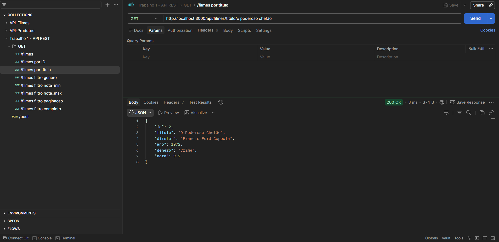

localhost:3000/api/filmes?genero=Ficção

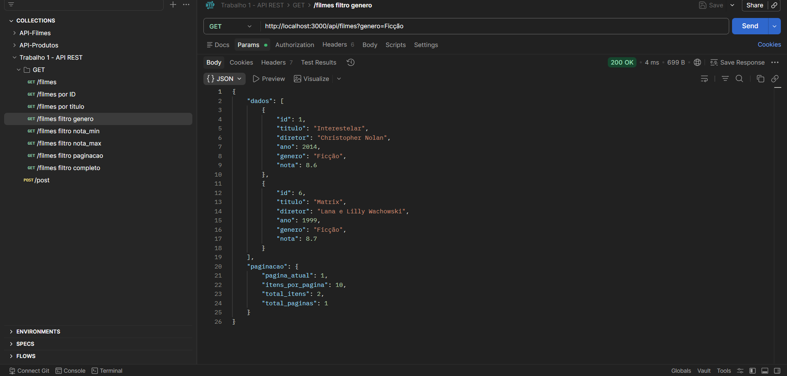

localhost:3000/api/filmes?ordem=nota&direcao=asc&nota_min=8.4&pagina=1&limite=5

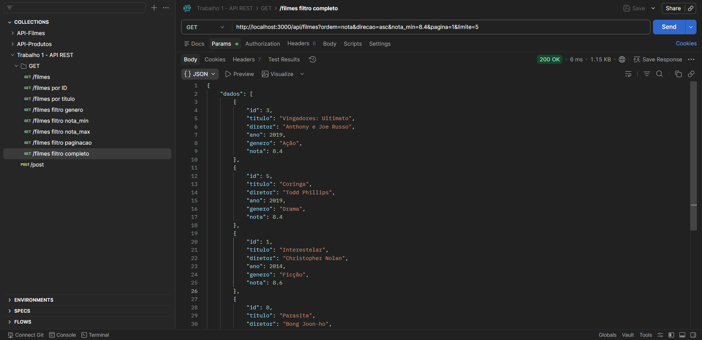

### - POST

localhost:3000/api/filmes

Post 1

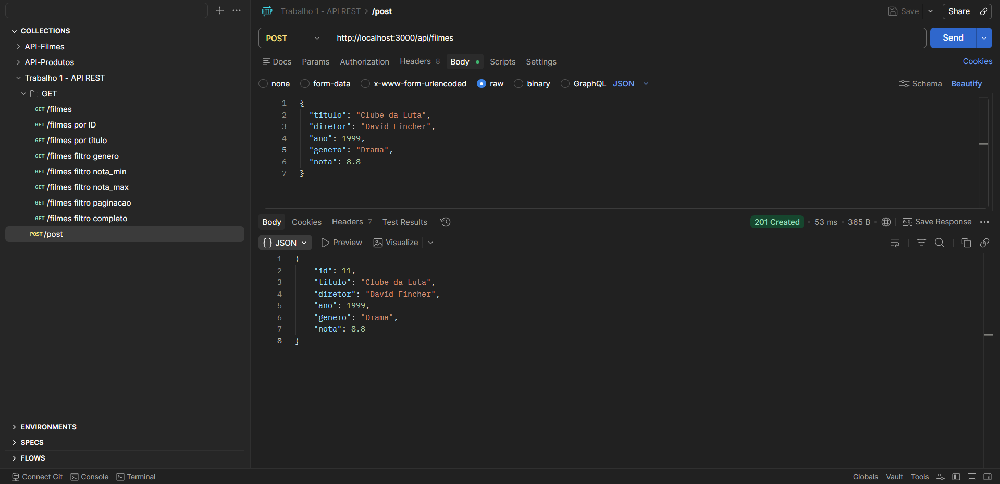

Post 2

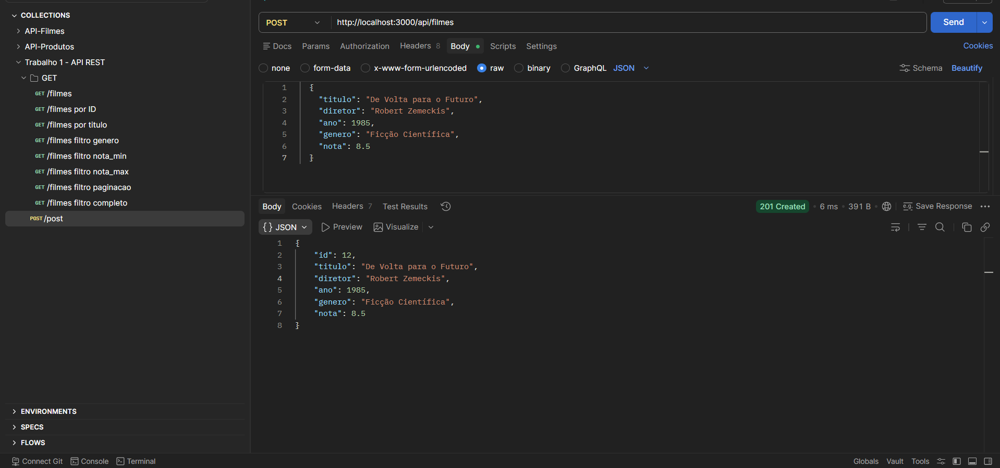

Post 3

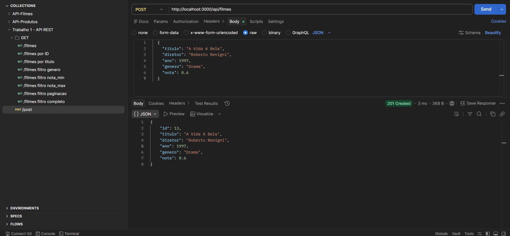

Post 4

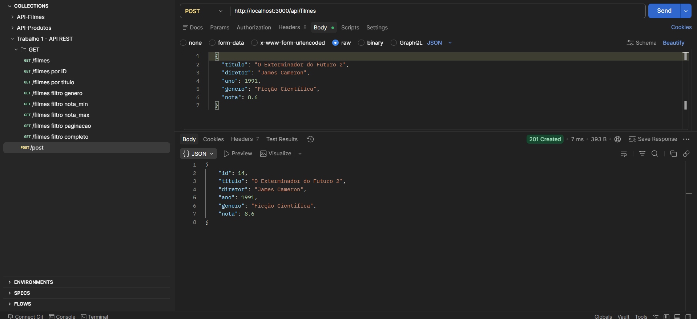

Post 5

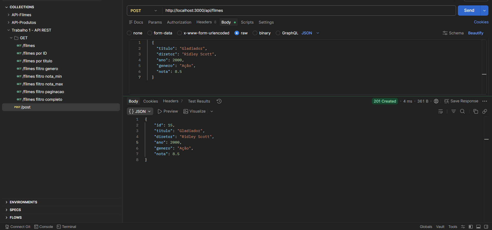

GET em todos os filmes após dar 5 POSTs

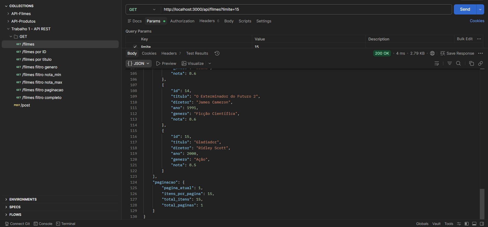

---

## 📄 Conclusão

Este trabalho permitiu a realização prática de uma API REST podendo entender seu funcionamento, incluindo a criação de endpoints, manipulação de requisições HTTP e implementação de validações.

Além disso, o uso do Postman foi essencial para testar e validar o comportamento da API, garantindo seu correto funcionamento.

O trabalho pôde contribuir com uma melhor compreensão de como uma API REST pode funcionar utilizando os endpoints GET e POST.

No geral serviu de grande aprendizado e agora é o momento de aprender ainda mais.
