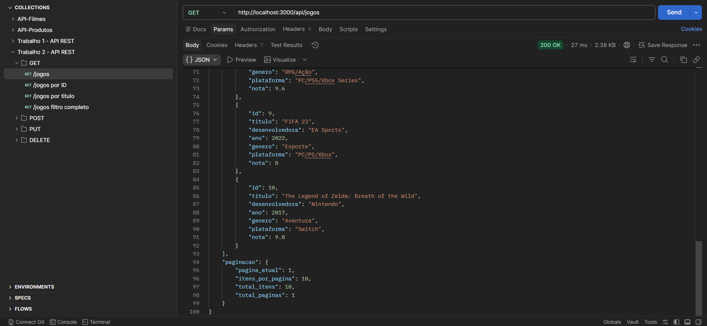
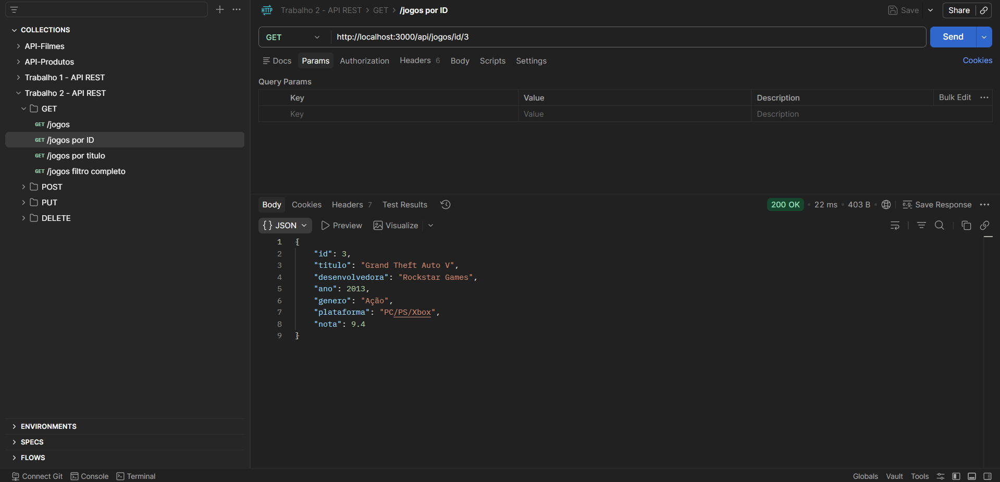
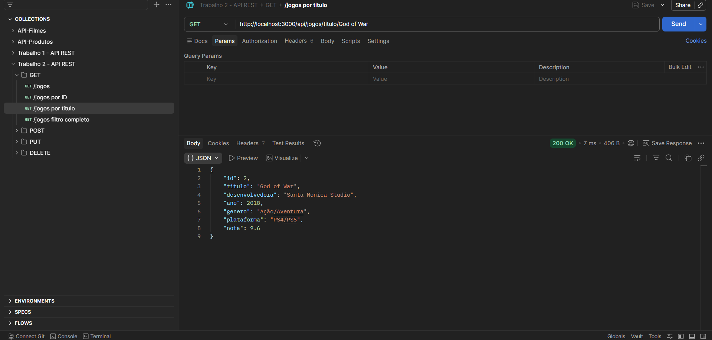
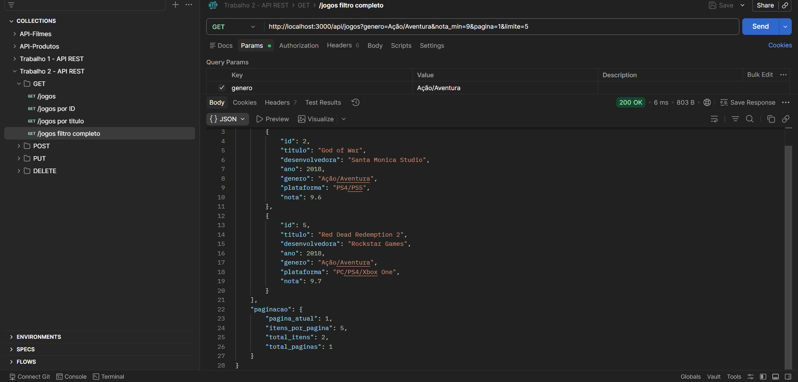
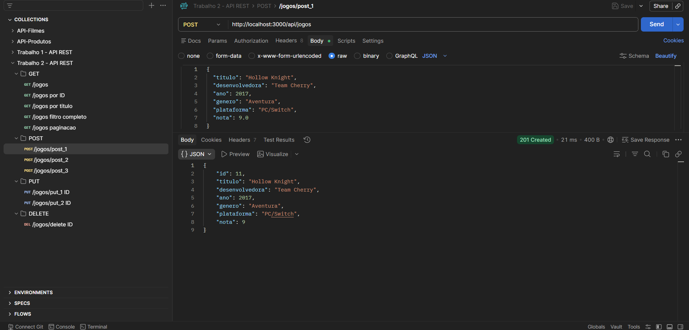
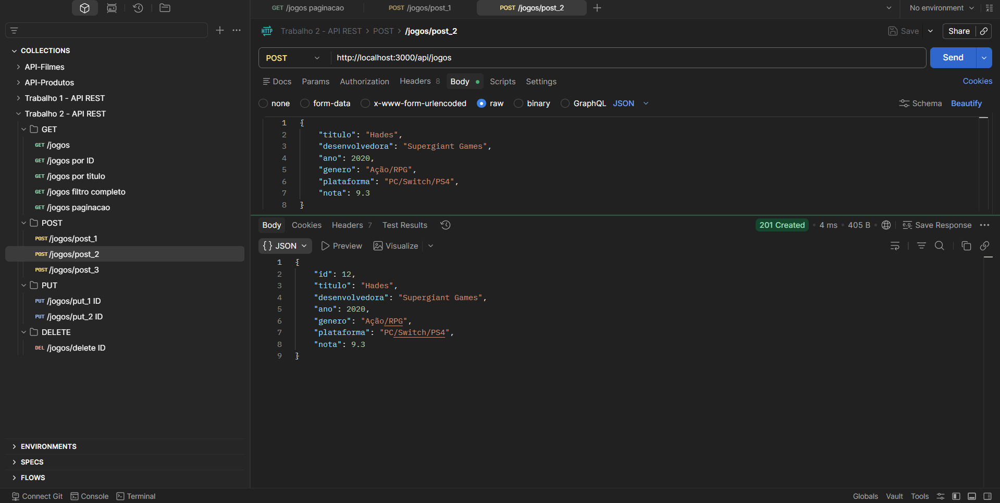
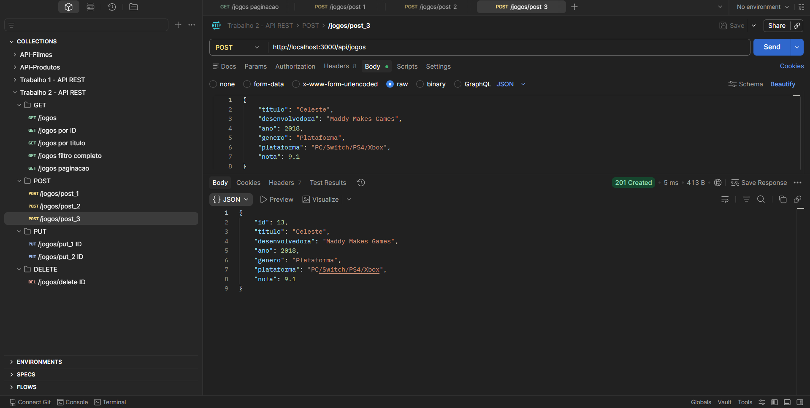
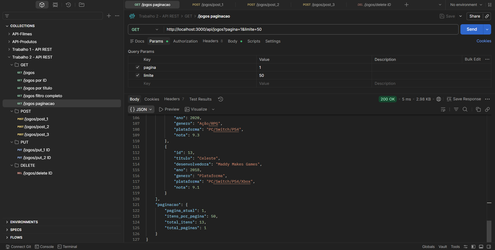
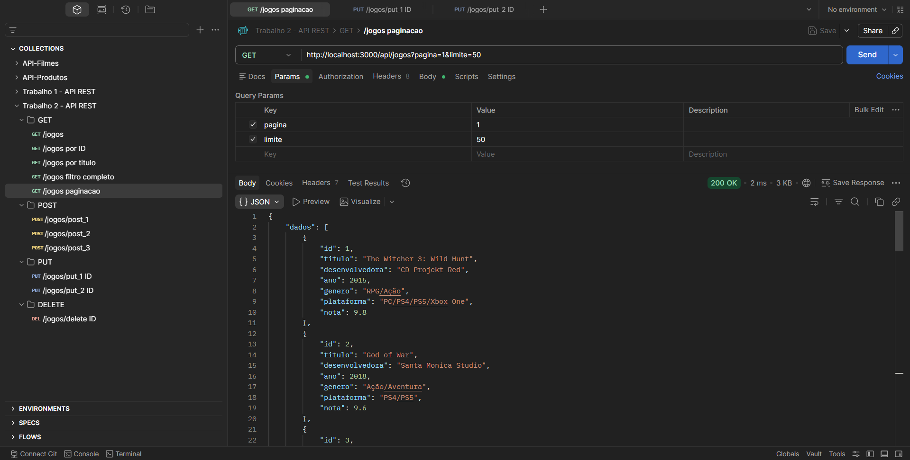
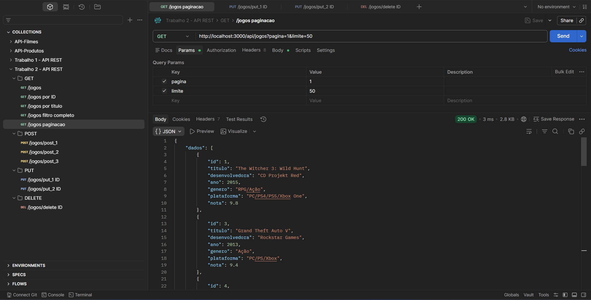

# **API REST com Node.js e Express**

## Informações do Aluno

**Nome**: Gabriel Henrique Navela Casarini

**Curso**: Ciência da Computação (UNIFIL)

## Introdução

Este repositório consiste em um trabalho acadêmico com o objetivo de aplicar alguns conceitos relacionados a API REST, desde a implementação de ENDPOINTS até testes com o POSTMAN validando suas funcionalidades.

Após a conclusão do Trabalho 1 envolvendo somente os endpoints **GET** e **POST**, neste foi implementado mais 2 tipos:

* **PUT** (Atualizar registro)
* **DELETE** (Remover registro)

Os registros e campos dessa API se tratam de jogos eletrônicos, com isso novos registros devem seguir o padrão deste tema.

A seguir estão as informações detalhadas sobre o projeto.

---

## Tecnologias utilizadas para desenvolvimento

* Node.js
* Express
* Postman
* Visual Studio Code
* Git

---

## ⚙️ Configuração do ambiente
```bash
# Criar pasta do projeto
mkdir nome-do-projeto
cd nome-do-projeto

# Inicializar projeto Node.js
npm init -y

# Instalar Express
npm install express

# Instalar Nodemon (opcional)
npm install --save-dev nodemon

# Criar arquivo principal
touch index.js 
# (No PowerShell, utilize: ni index.js)

# Criar arquivo .gitignore (aconselhável)
touch .gitignore
```

---

### .gitignore (Não enviar arquivos extensos ao GitHub)

Adicionar o seguinte conteúdo:
```bash
node_modules/
.env
package-lock.json
```

---

### Ajuste do package.json (scripts)

Para facilitar a execução do projeto, é possível configurar scripts no arquivo `package.json`:
```json
"scripts": {
  "start": "node index.js",
  "dev": "nodemon index.js"
}
```

Após isso, você pode iniciar o projeto com:
```bash
npm start
```

ou em modo desenvolvimento:
```bash
npm run dev
```

---

## Funcionalidades da API

* Listagem de dados (GET)
* Busca com filtros
* Cadastro de novos registros (POST)
* Atualização de registros existentes (PUT)
* Remoção de registros (DELETE)
* Validação de dados de entrada
* Organização dos dados em formato JSON

---

## Endpoints da API

Na API deste trabalho, foram desenvolvidos os seguintes ENDPOINTS:

* 5 ENDPOINTS **GET**
* 1 ENDPOINT **POST**
* 1 ENDPOINT **PUT**
* 1 ENDPOINT **DELETE**

### - GET
```bash
# Tela inicial ao iniciar a API
app.get('/'...)

URL: http://localhost:3000/
```
```bash
app.get('/api/info'...)

URL: http://localhost:3000/api/info
```
```bash
# Listagem de todos os jogos ou filtrados a depender da URI
app.get('/api/jogos'...)

URL: http://localhost:3000/api/jogos
```
```bash
# Lista um jogo pelo ID de forma específica (PATH PARAMETER)
app.get('/api/jogos/id/:id'...)

URL: http://localhost:3000/api/jogos/id/1
```
```bash
# Lista um jogo pelo TÍTULO de forma específica (PATH PARAMETER)
app.get('/api/jogos/titulo/:titulo'...)

URL: http://localhost:3000/api/jogos/titulo/minecraft
```

### - POST
```bash
# Cria um novo registro de jogo após realizar as validações
app.post('/api/jogos'...)

URL: http://localhost:3000/api/jogos
```

### - PUT
```bash
# Atualiza completamente um registro de jogo informando o ID
app.put('/api/jogos/:id'...)

URL: http://localhost:3000/api/jogos/1
```

### - DELETE
```bash
# Remove um registro de jogo informando o ID
app.delete('/api/jogos/:id'...)

URL: http://localhost:3000/api/jogos/1
```

---

## GET - Listagem dos recursos

**Filtros disponíveis**

* genero → filtra por gênero
* busca → busca por título
* nota_min → nota mínima
* nota_max → nota máxima
* ano_min → ano mínimo
* ano_max → ano máximo

**Ordenação**

* ordem = nota | ano | titulo (3 tipos de ordenação presentes)
* direcao = asc | desc (Ordem **crescente** / **decrescente**)

---

## POST - Criação de recursos

Para adicionar novos recursos com o POST, é necessário inserir um registro em JSON no Postman.

Exemplo (JSON):
```json
{
  "titulo": "Hollow Knight",
  "desenvolvedora": "Team Cherry",
  "ano": 2017,
  "genero": "Aventura",
  "plataforma": "PC/Switch",
  "nota": 9.0
}
```

---

## PUT - Atualização de recursos

Para atualizar um registro existente, é necessário informar o ID na URL e enviar todos os campos no corpo da requisição em JSON no Postman.

Exemplo (JSON) -
Alterando gênero, plataforma e nota:

```json
{
  "titulo": "Hollow Knight",
  "desenvolvedora": "Team Cherry",
  "ano": 2017,
  "genero": "RPG/Aventura",
  "plataforma": "PC/Switch/PS4",
  "nota": 9.2
}
```

---

## DELETE - Remoção de recursos

Para remover um registro, basta informar o ID na URL. Nenhum corpo é necessário na requisição.

Exemplo:
```bash
DELETE http://localhost:3000/api/jogos/1
```

---

## **Validações implementadas**

No POST e PUT, algumas validações foram implementadas para impedir que um registro fosse inserido ou atualizado de forma incorreta.

Um exemplo é o cadastro do ID que ocorre de forma automática, impedindo assim que o usuário consiga manipular esse valor.

As validações são:

## **1 - Campos obrigatórios**

Todos os campos abaixo são obrigatórios:
* titulo
* desenvolvedora
* ano
* genero
* plataforma
* nota

Caso algum campo esteja ausente, o terminal vai apontar um erro:
```json
{
  "erro": "Campos obrigatórios: titulo, desenvolvedora, ano, genero, plataforma, nota"
}
```

## **2 - Validação de tipos de dados**

Os tipos devem ser respeitados:

* titulo → string
* desenvolvedora → string
* genero → string
* plataforma → string
* ano → number
* nota → number

Se houver erro de tipo, o terminal irá apontar:
```json
{
  "erro": "Titulo, desenvolvedora, genero e plataforma devem ser texto (String)"
}
```
ou
```json
{
  "erro": "Ano e nota devem ser números (Number)"
}
```

## **3 - Regras de negócio**

Regras que permitem maior consistência ao sistema, Exemplo:

* A nota deve estar entre 0 e 10
```json
{
  "erro": "Nota deve estar entre 0 e 10"
}
```

---

## Dados criados via POST
Arquivos JSON utilizados para adicionar recursos ao array:
```json
{
  "titulo": "Hollow Knight",
  "desenvolvedora": "Team Cherry",
  "ano": 2017,
  "genero": "Aventura",
  "plataforma": "PC/Switch",
  "nota": 9.0
},
{
  "titulo": "Hades",
  "desenvolvedora": "Supergiant Games",
  "ano": 2020,
  "genero": "Ação/RPG",
  "plataforma": "PC/Switch/PS4",
  "nota": 9.3
},
{
  "titulo": "Celeste",
  "desenvolvedora": "Maddy Makes Games",
  "ano": 2018,
  "genero": "Plataforma",
  "plataforma": "PC/Switch/PS4/Xbox",
  "nota": 9.1
}
```

---

## 📸 Testes no Postman (Capturas de tela)

### - GET

- localhost:3000/api/jogos



- localhost:3000/api/jogos/id/3



- localhost:3000/api/jogos/titulo/god of war



localhost:3000/api/jogos?genero=Ação/Aventura&nota_min=9&pagina=1&limite=5



---

### - POST

localhost:3000/api/jogos

Post 1



Post 2



Post 3



GET em todos os jogos após dar 3 POSTs



---

### - PUT

localhost:3000/api/jogos/1


Dando **GET** jogos após dar o put no ID 1



---

### - DELETE

localhost:3000/api/jogos/2


Dando **GET** jogos após dar o delete no ID 2



---

## 📄 Conclusão

Este trabalho permitiu a realização prática de uma API REST implementando, além do que foi desenvolvido no trabalho 1 (GET e POST), os endpoints PUT e DELETE.

Além disso, o uso do Postman foi essencial para testar e validar o comportamento da API, garantindo seu correto funcionamento.

Ao fim foi alcançado uma API REST com os 4 endpoints principais funcionando e trazendo os resultados de cada requisição corretamente.